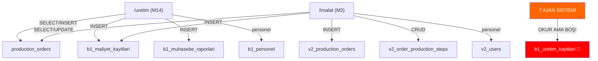

# 🏭 ÜRETİM BANDI + İMALAT — TAM DENETİM RAPORU VE GÖREV DAĞILIMI

**Tarih:** 16 Mart 2026 — 06:53 | **Proje:** 47 Sil Baştan (THE ORDER / NİZAM)
**Kapsam:** `/uretim` (M14) + `/imalat` (M3/M6) + Ajanlar (`ajanlar-v2.js`)

---

## 📍 MEVCUT SİSTEM HARİTASI



---

## 📊 5 BAKIŞ AÇISI — SKOR KARTESİ

| # | Bakış Açısı | Puan | En Büyük Eksik |
|---|-------------|:----:|----------------|
| 1 | 👔 İşletme Sahibi | ⭐⭐ 2/5 | Dashboard/KPI yok — "bugün kaç ürettik" cevaplanamıyor |
| 2 | 🔧 Saha Yöneticisi | ⭐⭐⭐ 3/5 | Personel-iş eşleştirme yok, işlem sırası (rota kartı) yok |
| 3 | 💰 Mali Müdür | ⭐⭐ 2/5 | Birim maliyet, hedef vs gerçek, fire maliyeti hesaplanmıyor |
| 4 | 🏗️ Sistem Mühendisi | ⭐⭐⭐ 3/5 | İki modül çakışması, hayalet tablolar, realtime eksik |
| 5 | 🤖 Ajan Koordinatörü | ⭐ 1/5 | Ajanlar hayalet tabloya bakıyor, üretim verisi sıfır |

---

## 🔴 18 HATA / EKSİK / HAYALET — TAM LİSTE

### KRİTİK SEVİYE (5 adet)

| # | Simge | Sorun | Dosya | Satır |
|---|:-----:|-------|-------|:-----:|
| 1 | 🧟 | **HAYALET TABLO `b1_uretim_kayitlari`** — 5 ajan bu tabloyu okuyor ama hiçbir sayfa yazmıyor. Ajanlar kör | [ajanlar-v2.js](file:///C:/Users/Esisya/Desktop/47_SilBaştan/src/lib/ajanlar-v2.js) | 108, 204, 248, 483, 783 |
| 2 | 💀 | **KIRIK LİNK `/finans`** — İmalat'ta NextLink var ama route mevcut değil → 404 | [ImalatMainContainer.js](file:///C:/Users/Esisya/Desktop/47_SilBaştan/src/features/imalat/components/ImalatMainContainer.js) | 363 |
| 3 | ⚔️ | **TABLO ÇATIŞMASI** — `production_orders` iki modülden farklı mantıkla kullanılıyor | Her iki modül | — |
| 4 | 🔓 | **PIN TUTARSIZLIĞI** — M14 → `sb47_uretim_pin` (atob), M3 → `sb47_uretim_token` (direkt) | [UretimSayfasi.js](file:///C:/Users/Esisya/Desktop/47_SilBaştan/src/features/uretim/components/UretimSayfasi.js) / [ImalatMainContainer.js](file:///C:/Users/Esisya/Desktop/47_SilBaştan/src/features/imalat/components/ImalatMainContainer.js) | 38 / 68 |
| 5 | 🔧 | **HARDCODED MALİYET 168₺** — `42dk × 4₺` sabit, gerçek kronometre kullanılmıyor | [ImalatMainContainer.js](file:///C:/Users/Esisya/Desktop/47_SilBaştan/src/features/imalat/components/ImalatMainContainer.js) | 309-311 |

### YÜKSEK SEVİYE (7 adet)

| # | Simge | Sorun | Dosya | Satır |
|---|:-----:|-------|-------|:-----:|
| 6 | 🔧 | **HARDCODED "42 dk"** — UI'da süre sabit, `start_time - end_time` hesaplanmıyor | [ImalatMainContainer.js](file:///C:/Users/Esisya/Desktop/47_SilBaştan/src/features/imalat/components/ImalatMainContainer.js) | 731 |
| 7 | 🔧 | **HARDCODED "GÜVENLİ"** — Maliyet kontrolü yapılmıyor, her zaman yeşil | [ImalatMainContainer.js](file:///C:/Users/Esisya/Desktop/47_SilBaştan/src/features/imalat/components/ImalatMainContainer.js) | 735 |
| 8 | 🕳️ | **BOŞ FPY FONKSİYONU** — `if (islem.worker_id) { }` içi tamamen boş | [ImalatMainContainer.js](file:///C:/Users/Esisya/Desktop/47_SilBaştan/src/features/imalat/components/ImalatMainContainer.js) | 322-323 |
| 9 | 🕳️ | **FİRE MALİYETİ YOK** — Telegram "hesaplanıyor" diyor ama hiçbir hesap yok | [ImalatMainContainer.js](file:///C:/Users/Esisya/Desktop/47_SilBaştan/src/features/imalat/components/ImalatMainContainer.js) | 339 |
| 10 | ⚔️ | **PERSONEL ŞEMA ÇATIŞMASI** — M14 `b1_personel`(ad_soyad) vs M3 `v2_users`(full_name) | İki farklı servis | — |
| 11 | 🧟 | **TEKNİK FÖY UI undefined** — `model_name`, `material_cost` alanları `production_orders`'da yok | [ImalatMainContainer.js](file:///C:/Users/Esisya/Desktop/47_SilBaştan/src/features/imalat/components/ImalatMainContainer.js) | 449-457 |
| 12 | 🔧 | **DEVİR RAPORU `net_uretilen_adet: 0`** sabit — `quantity` kullanılmıyor | [uretimApi.js](file:///C:/Users/Esisya/Desktop/47_SilBaştan/src/features/uretim/services/uretimApi.js) | 112-113 |

### ORTA SEVİYE (6 adet)

| # | Simge | Sorun | Dosya | Satır |
|---|:-----:|-------|-------|:-----:|
| 13 | 🧟 | **`useImalat` HOOK KULLANILMIYOR** — Export var ama import eden sayfa yok | [useImalat.js](file:///C:/Users/Esisya/Desktop/47_SilBaştan/src/features/imalat/hooks/useImalat.js) | 1-77 |
| 14 | 🧟 | **`b1_imalat_emirleri` HAYALET** — Servis + hook var ama çağıran sayfa yok | [imalatApi.js](file:///C:/Users/Esisya/Desktop/47_SilBaştan/src/features/imalat/services/imalatApi.js) | 1-46 |
| 15 | ⚔️ | **İKİ MODÜL AYNI İŞ** — `/uretim` ve `/imalat` birbirinden habersiz, aynı işi yapıyor | İki route | — |
| 16 | 🔧 | **VİDEO KAYDI SAHTE** — Toggle boolean var ama gerçek kamera API'si yok | [ImalatMainContainer.js](file:///C:/Users/Esisya/Desktop/47_SilBaştan/src/features/imalat/components/ImalatMainContainer.js) | 503 |
| 17 | ⚔️ | **REALTIME SADECE M3'TE** — M14'te Supabase subscription yok, eski veri görünür | [UretimSayfasi.js](file:///C:/Users/Esisya/Desktop/47_SilBaştan/src/features/uretim/components/UretimSayfasi.js) | — |
| 18 | 🧟 | **`DURUS_KODLARI` KULLANILMIYOR** — Import edilmiş ama UI'da hiçbir yerde gösterilmiyor | [UretimSayfasi.js](file:///C:/Users/Esisya/Desktop/47_SilBaştan/src/features/uretim/components/UretimSayfasi.js) | 9 |

---

## 🤖 GÖREV DAĞILIMI — 3 BOT

### 🅰️ BOT-A (Antigravity #1) — AJAN SİSTEMİ + HAYALET TEMİZLİĞİ
**Sorumluluk:** Hata 1, 13, 14, 18

| Görev | Detay |
|-------|-------|
| ✅ `ajanlar-v2.js` düzelt | 5 ajandaki `b1_uretim_kayitlari` → `production_orders` + `b1_imalat_emirleri` olarak güncelle |
| ✅ Hayalet temizliği | `useImalat` hook'u ya entegre et ya da sil, `DURUS_KODLARI`'nı UI'a bağla |
| ✅ Ajan kontrol ekle | Sabah Subayı + Nabız'a `production_orders` gecikme kontrolü ekle |

---

### 🅱️ BOT-B (Antigravity #2) — İMALAT HARDCODED + BOŞ FONKSİYON
**Sorumluluk:** Hata 5, 6, 7, 8, 9, 11

| Görev | Detay |
|-------|-------|
| ✅ Hardcoded 168₺ düzelt | `start_time - end_time` farkıyla gerçek süre hesapla, `NEXT_PUBLIC_DAKIKA_UCRETI` kullan |
| ✅ "42 dk" ve "GÜVENLİ" düzelt | Gerçek süreyi ve hedef vs gerçek maliyet karşılaştırmasını UI'a bağla |
| ✅ Boş FPY fonksiyonu doldur | `worker_id` varsa `v2_users.fp_yield` güncelle |
| ✅ Fire maliyetini hesapla | Red edilen işlere zarar fişi aç, `b1_maliyet_kayitlari`'na yaz |
| ✅ Teknik Föy UI düzelt | `production_orders` JOIN `b1_model_taslaklari` alanlarını doğru göster |

---

### 🅲️ BOT-C (Antigravity #3) — ÜRETİM API + BİRLEŞTİRME + GÜVENLİK
**Sorumluluk:** Hata 2, 3, 4, 10, 12, 15, 16, 17

| Görev | Detay |
|-------|-------|
| ✅ Kırık `/finans` link düzelt | Ya route oluştur ya da mevcut bir sayfaya (`/muhasebe` veya `/kasa`) yönlendir |
| ✅ PIN birleştir | Her iki modülde `sb47_uretim_pin` + `atob()` standardına çek |
| ✅ Personel birleştir | İki modülü tek personel kaynağına bağla (`b1_personel`) |
| ✅ Devir raporunu düzelt | `net_uretilen_adet` → `order.quantity`, `zayiat_adet` → gerçek fire sayısı |
| ✅ Realtime ekle (M14) | Üretim sayfasına Supabase realtime subscription ekle |
| ✅ Modül ilişkisini netleştir | İki modülün veri akışını belgele veya tek çatıya taşı |

---

## 📋 COPY-PASTE PROMPT'LAR (Bot'lara Yapıştır)

### 🅰️ BOT-A İÇİN PROMPT:
```
47_SilBaştan projesinde ajanlar-v2.js dosyasını aç. 5 ajan (Sabah Subayı, Akşamcı, 
Zincirci, Muhasebe Yazıcı) 'b1_uretim_kayitlari' tablosunu okuyor ama bu tablo hayalet — 
hiçbir sayfa bu tabloya yazmıyor. Gerçek tablolar: production_orders ve b1_imalat_emirleri.

GÖREVLER:
1. ajanlar-v2.js satır 108, 204, 248, 483-494, 783'teki b1_uretim_kayitlari referanslarını 
   production_orders tablosuna çevir. Kolon isimleri: status (pending/in_progress/completed), 
   planned_end_date, model_id
2. Sabah Subayı + Nabız ajanlarına production_orders için gecikme kontrolü ekle
3. UretimSayfasi.js satır 9'daki DURUS_KODLARI importunu Kalite sekmesinde UI'a bağla
4. useImalat.js hook'unu ImalatMainContainer'a entegre et veya gereksizse temizle
```

### 🅱️ BOT-B İÇİN PROMPT:
```
47_SilBaştan projesinde ImalatMainContainer.js dosyasını aç (760 satır). 6 kritik hata var:

1. SATIR 309-311: Hardcoded maliyet 42dk×4₺=168₺ → start_time/end_time farkıyla gerçek 
   süreyi hesapla, NEXT_PUBLIC_DAKIKA_UCRETI env değişkenini kullan
2. SATIR 731: UI'da "42 dk" sabit → gerçek süreyi göster
3. SATIR 735: "GÜVENLİ" sabit → hedef maliyet vs gerçek maliyeti karşılaştır
4. SATIR 322-323: if(islem.worker_id){} BOŞ → v2_users tablosunda fp_yield güncelle
5. SATIR 339: Fire maliyeti "hesaplanıyor" diyor ama yok → b1_maliyet_kayitlari'na zarar fişi
6. SATIR 449-457: Teknik Föy UI undefined → production_orders JOIN b1_model_taslaklari
```

### 🅲️ BOT-C İÇİN PROMPT:
```
47_SilBaştan projesinde 8 hata düzeltilecek:

1. ImalatMainContainer.js:363 → /finans kırık link, /muhasebe veya /kasa'ya yönlendir
2. ImalatMainContainer.js:68 → sb47_uretim_token → sb47_uretim_pin olarak değiştir, 
   atob() kontrolü ekle (UretimSayfasi.js:38 ile aynı yap)
3. ImalatMainContainer.js:245 → v2_users yerine b1_personel kullan, alan adlarını eşle
4. uretimApi.js:112-113 → devirYap fonksiyonunda net_uretilen_adet: 0 → order.quantity değerini çek
5. UretimSayfasi.js → Supabase realtime subscription ekle (M3'teki gibi)
6. İki modülün (/uretim ve /imalat) hangi akışı kullandığını README.md'ye belgele
```
